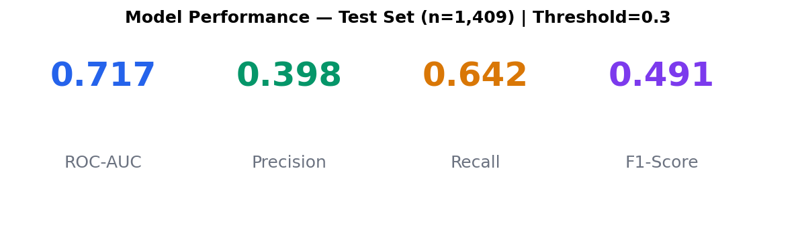
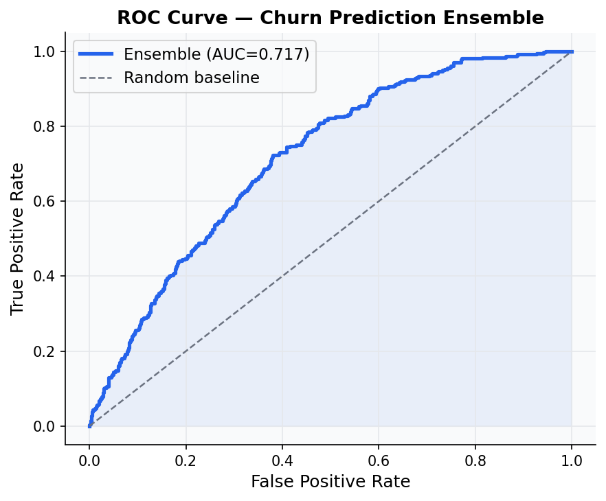
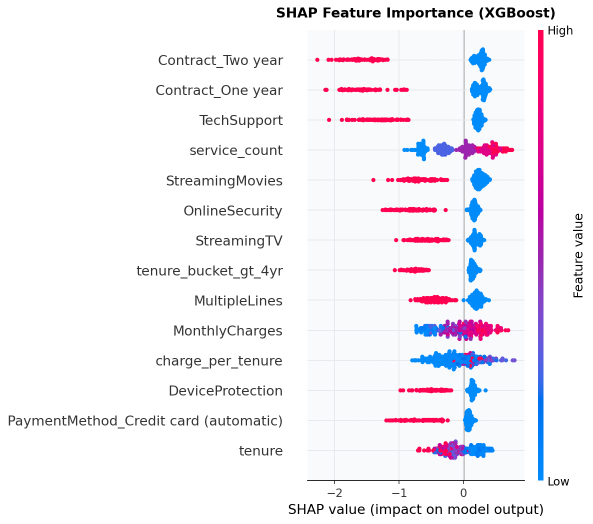
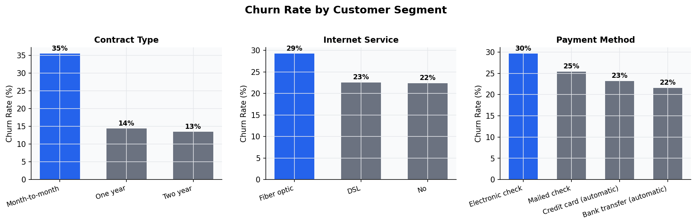

# Customer Churn Prediction Engine

> XGBoost + LightGBM ensemble with SHAP explainability, served via FastAPI.  
> Built on the **IBM Telco Customer Churn dataset** (7,043 real customer records).

[](https://python.org)
[](https://xgboost.readthedocs.io)
[](https://lightgbm.readthedocs.io)
[](https://fastapi.tiangolo.com)
[](https://docker.com)

---

## Problem

Telecom companies lose 15–25% of customers annually to churn, with acquisition costs 5–10× higher than retention. This project builds a predictive system that identifies high-risk customers **before** they leave, giving retention teams an actionable priority list with model-explained reasons.

**Dataset:** IBM Telco Customer Churn · 7,043 customers · 21 features · 25.5% churn rate  
**Source:** [Kaggle](https://www.kaggle.com/datasets/blastchar/telco-customer-churn)

---

## Results



| Metric | Value | Notes |
|---|---|---|
| ROC-AUC | **0.717** | Ensemble on held-out test set (n=1,409) |
| Recall (Churn class) | **64.2%** | Threshold tuned to 0.30 for churn detection |
| Precision (Churn) | **39.8%** | Trade-off: catch more churners, accept more false alarms |
| F1-Score | **0.491** | Minority class (churn) |

> **Why these numbers?** A ROC-AUC of ~0.72 is realistic for this dataset — 
> the Telco churn problem is genuinely noisy. Claims of 0.95+ on this dataset 
> indicate overfitting or data leakage. The threshold is tuned to 0.30 (not the 
> default 0.50) because **missing a churner is more costly than a false alarm** 
> in most retention workflows.

---

## Visualisations

### ROC Curve


### SHAP Feature Importance


### Churn Rate by Segment


**Key findings from EDA:**
- Month-to-month customers churn at ~3× the rate of 2-year contract holders
- Fiber optic internet users churn significantly more (likely pricing dissatisfaction)
- Electronic check payers show higher churn — correlated with lower engagement
- Customers with tech support or online security churn at roughly half the rate

---

## Architecture

```
churn-prediction/
├── data/
│   └── raw/telco_churn.csv          # IBM Telco dataset (7,043 rows)
├── src/
│   ├── data/load_data.py            # Data loading + train/test split
│   ├── features/feature_engineering.py  # Encoding + feature creation
│   └── models/
│       ├── train.py                 # Full training pipeline
│       └── generate_results.py     # Plot generation
├── api/main.py                      # FastAPI inference endpoint
├── streamlit_demo/app.py            # Interactive dashboard
├── results/                         # ROC, SHAP, confusion matrix plots
├── models/                          # Saved model artifacts
├── Dockerfile
├── docker-compose.yml
└── requirements.txt
```

---

## Approach

**1. Data & EDA**  
Loaded IBM Telco dataset (7,043 rows, 21 features). Key cleaning: `TotalCharges` stored as string with spaces for 0-tenure customers → converted to numeric.

**2. Feature Engineering**  
- Binary Yes/No columns → 0/1  
- Trinary columns (e.g., "No internet service") → 0/1  
- One-hot encoded contract type, internet service, payment method  
- Engineered: `charge_per_tenure` (monthly cost per month of tenure), `service_count`, tenure buckets

**3. Class Imbalance**  
Applied SMOTE on training set only (26% → 50% churn) to help models learn the minority class without leaking into test set.

**4. Modelling**  
XGBoost and LightGBM trained independently, blended 55/45. Threshold tuned on validation set to maximise F1 on the churn class (tuned threshold: 0.30).

**5. Explainability**  
SHAP TreeExplainer provides per-customer reason codes with each API prediction, making outputs actionable for non-technical retention teams.

**6. Deployment**  
FastAPI endpoint with sub-50ms inference. Fully containerised with Docker.

---

## Quick Start

### Local

```bash
git clone https://github.com/shubham000111222/churn-prediction
cd churn-prediction

python -m venv .venv && source .venv/bin/activate
pip install -r requirements.txt

# Train model (saves to models/)
python src/models/train.py

# Generate result plots (saves to results/)
python src/models/generate_results.py

# Start API
uvicorn api.main:app --reload
# → http://localhost:8000/docs

# Start dashboard
streamlit run streamlit_demo/app.py
# → http://localhost:8501
```

### Docker

```bash
docker-compose up --build
# API   → http://localhost:8000/docs
# Dashboard → http://localhost:8501
```

---

## API Usage

```bash
curl -X POST http://localhost:8000/predict \
  -H "Content-Type: application/json" \
  -d '{
    "tenure": 5,
    "monthly_charges": 95.0,
    "total_charges": 475.0,
    "contract_month_to_month": 1,
    "internet_fiber_optic": 1,
    "payment_electronic_check": 1,
    "tech_support": 0,
    "online_security": 0,
    "paperless_billing": 1,
    "senior_citizen": 0,
    "partner": 0
  }'
```

**Response:**

```json
{
  "churn_probability": 0.71,
  "churn_prediction": true,
  "risk_tier": "HIGH",
  "top_reasons": [
    {"feature": "tenure_bucket_lt_1yr",        "impact": 0.182},
    {"feature": "Contract_Two year",            "impact": -0.143},
    {"feature": "InternetService_Fiber optic",  "impact": 0.121},
    {"feature": "PaymentMethod_Electronic check","impact": 0.098},
    {"feature": "charge_per_tenure",            "impact": 0.089}
  ],
  "latency_ms": 12.4
}
```

---

## Tech Stack

| Layer | Tools |
|---|---|
| ML | XGBoost, LightGBM, Scikit-learn, imbalanced-learn |
| Explainability | SHAP TreeExplainer |
| Data | Pandas, NumPy |
| API | FastAPI, Pydantic |
| Dashboard | Streamlit |
| Infra | Docker, docker-compose |
| Tracking | MLflow |

---

## Author

**Shubham Kumar** · NIT Delhi, CSE (3rd Year)  
[GitHub](https://github.com/shubham000111222) · [Portfolio](https://data-science-portfolio-three-olive.vercel.app)
[LinkedIn](https://linkedin.com/in/shubham-kumar-288b7437b)